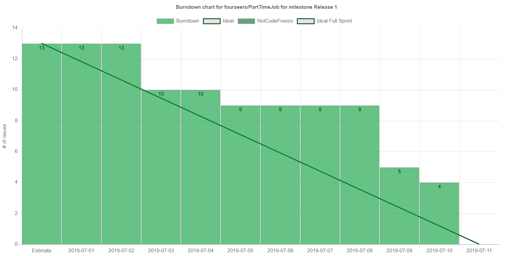

# 迭代评估报告

> 评估日期：2019.07.11

| 组号         | 13                    |
| ------------ | --------------------- |
| 项目名称     | 都市商圈灵活用工      |
| 迭代名称     | 迭代1                 |
| 计划起止日期 | 2019.07.01~2019.07.11 |
| 实际起止日期 | 2019.07.01~2019.07.11 |

## 任务达成情况

| No   | 任务                           | 计划起止日期 | 人员     | 完成情况 | 实际起止日期 |
| ---- | ------------------------------ | ------------ | -------- | -------- | ------------ |
| 1    | 前端环境配置                   | 7.1          | zjy, hsc | ✔        | 7.1          |
| 2    | 微服务架构搭建                 | 7.1~7.2      | sjh      | ✔        | 7.1          |
| 4    | 后端开发环境搭建（test，repo） | 7.1~7.2      | cyj,sjh  | ✔        | 7.2          |
| 3    | CI                             | 7.2~7.3      | cyj      | ✔        | 7.1          |
| 5    | OAuth微服务验证框架            | 7.3~7.4      | cyj,sjh  | ✔        | 7.2~7.4      |
| 6    | 确定前端页面风格、基本架构     | 7.2          | zjy,hsc  | ✔        | 7.1~7.2      |
| 7    | 商家注册与登录界面             | 7.3~7.4      | zjy      | ✔        | 7.2~7.3      |
| 8    | 用户注册与登录功能界面         | 7.3~7.4      | hsc      | ✔        | 7.2~7.3      |
| 9    | 登录注册API实现                | 7.3~7.4      | sjh,cyj  | ✔        | 7.4~7.8      |
| 10   | 商家添加管理店铺前端实现       | 7.4~7.5      | zjy      | ✔        | 7.4~7.5      |
| 11   | 商家发布岗位前端实现           | 7.8~7.9      | zjy      | ✔        | 7.4~7.5      |
| 12   | 用户选择应聘岗位前端实现       | 7.4~7.5      | hsc      | ✔        | 7.4~7.8      |
| 13   | 用户管理个人信息前端实现       | 7.8~7.9      | hsc      | ✔        | 7.4~7.5      |
| 14   | 后端商家信息管理API实现        | 7.4~7.5      | sjh      | ✔        | 7.5~7.7      |
| 15   | 后端用户信息管理API实现        | 7.8~7.9      | cyj      | ✔        | 7.8~7.10     |
| 16   | 后端商家岗位发布API实现        | 7.4~7.9      | sjh,cyj  | ✔        | 7.7~7.9      |
| 17   | 迭代最终验收测试               | 7.10~7.11    | 全员     | ✔        | 7.10~7.11    |
| 18   | 总结、撰写迭代报告             | 7.11         | cyj      | ✔        | 7.11         |

迭代1燃尽图如图所示：*（由于issue更新不及时，部分进度相比实际进度滞后）*

目前已实现并可以运行的功能1有：

* 商家注册与登录
* 用户注册与登录
* 商家添加店铺
* 商家发布岗位
* 商家管理店铺信息
* 用户管理个人信息

目前已实现前端配置，后端还未实现的功能有：

* 用户应聘岗位
* 用户管理自己的时间表

本次迭代的成果有：

* 两套前端，分别完成了基本框架并实现了迭代要求的功能；
* 微服务架构的后端Java代码与可执行Jar包；
* 部署微服务所需要的`Dockerfile`与相关脚本；
* 部署在实际服务器上的完整服务

与迭代计划相比较，基本完成了计划要求。

所有后端代码编写服从[`Google Java Style Guide`](../Google Java Style Guide.md)，在提交之前提交了测试代码并由CI工具进行持续集成测试。前端代码进行了简单的黑盒测试，并在提交之前由前端后端人员共同进行代码审查。

项目配置了代码风格检查工具`CodeBeat`，目前评级为`A`的代码文件数量在总量的85%左右。

## 问题、变更与返工

在迭代1的开发中，我们遇到了如下问题：

* 后端开发与前端开发步调不一致。前端开发的进度很快，后端开发的进度有些跟不上。在下一次迭代中，可以考虑让前端开发的同学加入到后端开发中，帮助进行后端接口的设计，编写测试等。
* 前后端沟通的问题。在实现接口时，前后端使用文档进行沟通，但某些后端人员有时*（其实是经常）*在实现时擅自修改了接口定义，未与前端人员及时说明，也没有在既定文档中体现。可见，开发流程需要进一步严格化。
* 后端开发中依赖管理不完善。虽然后端项目中使用了层级maven项目，但顶层项目中没有定义好`<dependencyMangement>`相关配置，导致目前各子项目中依赖版本配置互相分离。此问题需要在第二次迭代中首先解决。
* 前端界面实现问题。问题主要集中在小程序前端，有一些界面（如时间表管理界面）由于需求不清晰、相关类库的缺失实现起来比较困难。在下一次迭代中，需要首先详细、充分地讨论需求定义。
* 网关性能问题。目前的后端网关鉴权流程是，请求进入网关后，网关提取鉴权头部数据并向微服务发送HTTP请求检查鉴权数据。这样的设计会对延迟带来挑战。在下一次迭代中，计划将网关与鉴权微服务部分结合，减少这部分的overhead。
* 鉴权性能问题。后端用来加密密码数据的`BCrypt`算法执行需要大量计算资源，给注册与登录接口的并发性能带来挑战。经进一步查阅文档发现，注册与登录接口为抵御攻击通常将并发数设计得较低，我们所采用的`Spring`中的默认实现性能如此不堪其实是有意为之。因此，我们可能需要对项目的性能需求进行修改。但目前，我们首先考虑降低`BCrypt`算法的强度参数，或改用加盐的`SHA256`算法以获得并发性能的提升。
* 测试数据。目前项目没有合理、真实的测试数据，会给后续测试带来问题。在第二次迭代中，考虑分出时间从现有网站中爬取数据作为测试数据。

##  经验与教训

* 需要更加严格的开发流程。前后端人员需要严格遵守设计接口文档、编写测试用例、进行实现、测试、PR、review、集成测试的流程，尽量避免开发过程中的矛盾与效率问题。
* 更加合理地使用GitHub。例如，使用Issue管理新的feature与bug，通过在PR中refer issue的方式更新issue，以方便Project任务板的更新。
* 项目前期需要更高的效率。本次迭代中因为鉴权与网关服务的实现较难，给其他人的开发带来了进度风险。在面临前期的环境风险与配置风险时，需要及时上线，甚至可以先写出符合接口定义的假实现以方便全组的工作。
* 前后端开发人员的交流需要加强。特别是在接口定义方面，当接口定义有改动时需要及时沟通。
* 强调测试。测试能帮助开发人员及时有效地发现bug，切忌不写测试与测试未通过便提交到develop分支。