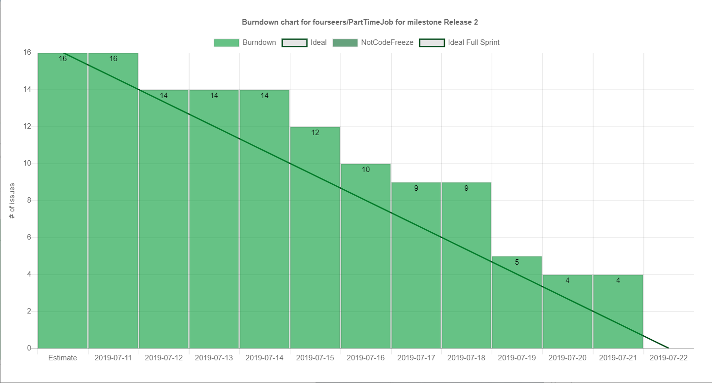
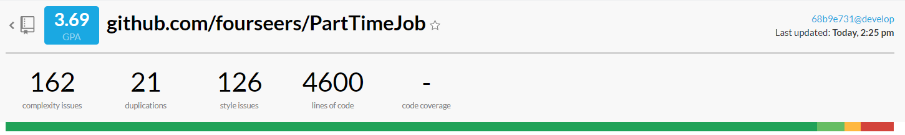

# 迭代评估报告

> 评估日期：2019.07.11

| 组号         | 13                    |
| ------------ | --------------------- |
| 项目名称     | 都市商圈灵活用工      |
| 迭代名称     | 迭代1                 |
| 计划起止日期 | 2019.07.12~2019.07.22 |
| 实际起止日期 | 2019.07.12~2019.07.22 |

## 任务达成情况

| No   | 任务                               | 起止日期  | 人员    | 完成情况 | 实际起止日期 |
| ---- | ---------------------------------- | --------- | ------- | -------- | ------------ |
| 1    | 确定进度安排                       | 7.12      | cyj     | ✔        | 7.12         |
| 2    | 微信端时间线界面                   | 7.12~7.15 | hsc     | ✔        | 7.12~7.16    |
| 3    | 用户应聘岗位后端实现               | 7.12~7.15 | cyj     | ✔        | 7.15~7.17    |
| 4    | 处理迭代1遗留问题                  | 7.12~7.15 | cyj,sjh | ✔        | 7.12~7.16    |
| 5    | 商家管理店铺信息功能               | 7.12~7.15 | zjy,sjh | ✔        | 7.12~7.15    |
| 6    | 用户筛选过滤可选岗位               | 7.16~7.17 | hsc,cyj | ✔        | 7.16~7.18    |
| 7    | 用户打卡前后端功能实现             | 7.18~7.19 | hsc,cyj | ✔        | 7.18~7.22    |
| 8    | 商家支付工资流程                   | 7.16~7.18 | zjy,sjh | ✔        | 7.16~7.18    |
| 9    | 商家支付、员工打卡统计页面相关功能 | 7.17~7.19 | zjy,sjh | ✔        | 7.19~7.21    |
| 10   | 管理员管理用户相关功能             | 7.17~7.19 | sjh,zjy | ✔        | 7.18~7.20    |
| 11   | 最终验收测试                       | 7.22      | 全员    | ✔        | 7.22         |
| 12   | 总结，撰写迭代报告                 | 7.22      | 全员    | ✔        | 7.22         |

迭代2燃尽图如图所示：*（由于issue更新不及时，部分进度相比实际进度滞后）*

目前已实现并可以运行的功能有：

- 用户微信端管理时间所用的时间线
- 用户微信端游览可应聘的岗位，按照地理位置远近排序
- 用户微信端应聘岗位
- 用户微信端上、下班打卡
- 商家端查看所有发布的岗位
- 商家端查看所有的店铺
- 商家端查看最近工作的完成情况
- 管理员端禁用/解禁用户的功能

本次迭代的成果有：

- 两套前端，分别完成了基本框架并实现了迭代要求的功能；
- 微服务架构的后端Java代码与可执行Jar包；
- 部署微服务所需要的Dockerfile；
- 微服务Python部署脚本
- 部署在实际服务器上的完整服务

部分功能实现还有待细化。与迭代计划相比较，基本完成了计划要求。

所有后端代码编写服从[`Google Java Style Guide`](../Google Java Style Guide.md)，在提交之前提交了测试代码并由CI工具进行持续集成测试。

前端代码进行了简单的黑盒测试，并在提交之前由前端后端人员共同进行代码审查。

所有部署到develop分支的代码交由Travis-CI即时部署到测试环境服务器中。

项目配置了代码风格检查工具`CodeBeat`。由于迭代二开始对后端代码进行了重构消除冗余代码，总评相对迭代一有很大提升。

## 问题、变更与返工

在迭代1的开发中，我们遇到了如下问题：

- 需求不明确的问题。由于组员与组长都埋头开发导致忘了确定需求，造成了一定的返工。例如开发过程中对岗位字段的理解不一致导致了项目后期更改接口与返工，造成了很大不便。
- 前后端开发速度不一致与沟通问题依然存在。                          
- 持续集成与部署问题。随着测试用例的增多，Travis-CI进行持续集成所消耗时间持续增长。目前的解决方法是在Travis-CI中并行运行多个微服务的测试，但本质的解决方式是修改测试类的配置加快测试运行速度（目前一个测试用例在CI环境中需要运行2~3秒）。
- 测试数据。目前虽然有测试数据但是数据量仍然较少，不能很好地体现真实的应用场景。

## 经验与教训

* 将非必要的重构向后推。重构的工作量可能远比预想的要多，因为有大量的旧代码需要适配。迭代中因该首先对功能进行实现后再进行重构，不然可能会使项目进度压力陡然增加。

- 接口需要提前确定好，方便前后端人员并行工作，对于接口的更改需要及时沟通。